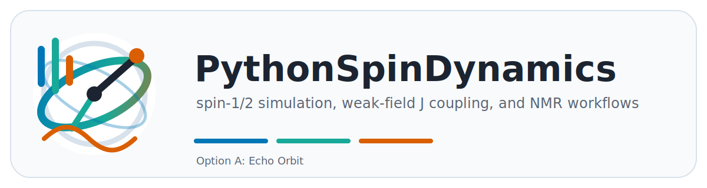
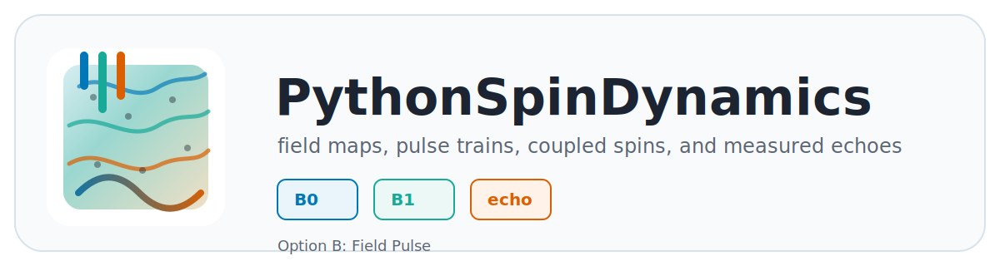
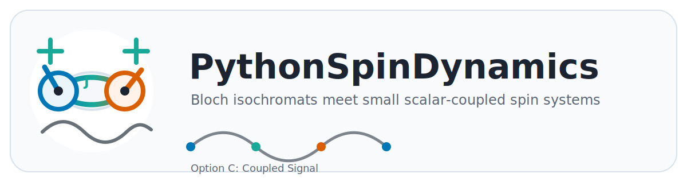

# PythonSpinDynamics Logo Options

These are draft SVG logo candidates sized for README headers and manual title
pages. They use the documentation palette already present in
`docs/user_manual.tex`.

The current preferred direction is Option A, revised as a project-level
umbrella logo under `../../../docs/assets/nmr_spin_dynamics_logo.svg` with the
wordmark `NMRSpinDynamics` and the subtitle "spin-1/2 simulations in
inhomogeneous fields."

## Option A: Echo Orbit

Emphasizes precession, pulse bars, and echo formation. This is the most general
project identity and works well as a README header for the sibling MATLAB and
Python repositories.

## Option B: Field Pulse

Emphasizes B0/B1 field maps, spatial variation, and pulse/echo workflows. This
leans toward the inhomogeneous-field focus of the package.

## Option C: Coupled Signal

Emphasizes the newer scalar-coupled spin layer and the bridge between coupled
spin dynamics and ensemble signals.
