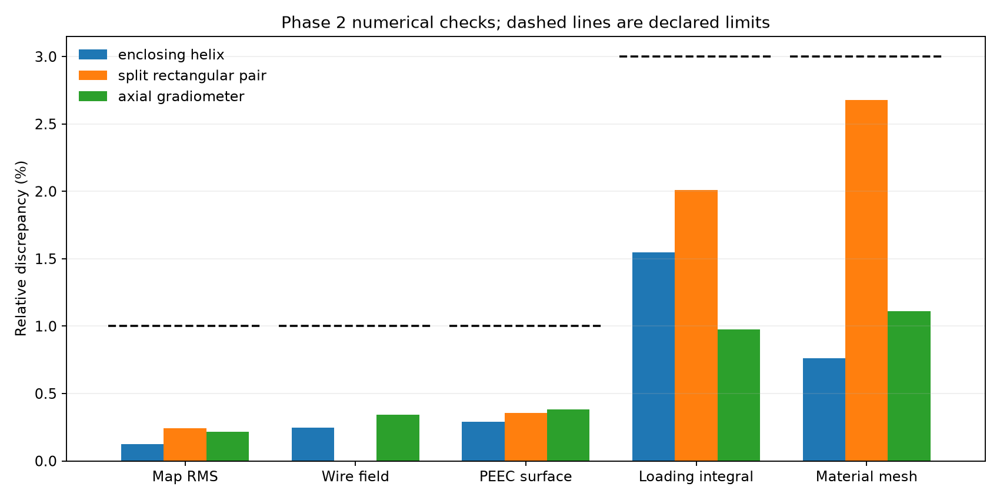

# Phase 2: parcel and aperture model

**Gate 2 passed on 2026-09-07 for the declared numerical validation family.**
`gate2_report.json` is the authoritative snapshot. It covers the three aperture
candidates, the mail cross-section and transit range below, and the listed
nonmetallic packet/paper material cases. It does not validate arbitrary parcel
contents, metal shielding, magnetic contents or the full-wave regime.

## Completed work

| Requirement | Implementation and evidence |
|---|---|
| Material regions and voxels | `aperture.Region`: identity, amount, crystal fraction, temperature, electrical properties, rotation and translation; mass-conserving voxel grids. |
| Coil candidates | Enclosing helix, split rectangular pair and axial gradiometer with explicit connecting paths. Split-pair feed gaps are 6 mm, clearing the 3 mm wire diameter. |
| Tx/Rx maps and convergence | Built-in Biot-Savart fields; reciprocal same-port maps on a 65 x 9 x 129 grid; 128 segments per turn; random and boundary validation points. |
| Coil network convergence | Built-in surface-impedance PEEC at 3.1024, 3.20335 and 3.3043 MHz; path, perimeter and full-vs-chain comparisons. |
| Spatial dielectric/conductive loading | Vacuum winding charge field plus inductive vector potential; uniform-contrast spectral bounds; an independent self-consistent cuboid-volume solve for different materials within a parcel. |
| Loaded circuit and tolerances | Actual series-tuning topology including coil self-capacitance and parcel shunt loss, with resonance, delivered current, drive Q/ringdown and receiver-port Johnson noise. |
| Level-A / Level-B evidence | Map interpolation versus direct fields, reduced versus finer material meshes, analytic sphere/slab bounds, and declared numerical acceptance criteria. |

The geometry numbers remain candidate inputs, not a selected design. The magnet
and coil remain inline with controllable motion. A changed magnet or coil placement
must also pass the Phase 1 Zeeman-spacing screen before system comparison.

## Results and tolerances

Worst observed discrepancies across candidates:

- Field-map RMS: 0.241% (limit 1%); maximum point error normalized by the validation
  field RMS: 4.84% (limit 5%). This is not pointwise relative error near field nulls.
- Wire-field refinement: about 0.35% (limit 1%).
- PEEC surface refinement: 0.384% (limit 1%); full-vs-chain discrepancy: 0.368%
  (limit 1%). The coarser full-model path check has a separate 2% criterion.
- Spatial electric-field energy integral: 2.01% (limit 3%).
- Reduced/fine material meshes: 2.68% (limit 3%), over 18 material/position/frequency
  cases and all three coils. Linear-solve residuals are below 1e-14.

The initial coarse meshes failed some of these criteria; wire paths and material
meshes were refined without relaxing the limits. `gate2_convergence.png` summarizes
selected checks. This is numerical verification, not measured accuracy.



## Domain and assumptions

The map spans x = +/-170 mm, y = +/-17.5 mm and z = +/-315 mm, including the fringe
region traversed by a 430 mm envelope. Material voxel refinements use three packet
translations (-100, 0, +100 mm); a separate transport integral uses 17, 33 and 65
positions. The material benchmark uses axis-aligned packet/paper regions. Rotation
transforms exist but arbitrary rotated material distributions are not gate-certified.

Uniform material envelopes explore relative permittivity 1.5, 3 and 6 and
conductivity 0, 1e-8 and 1e-4 S/m. Independent material checks include a uniform
case and two heterogeneous assignments (epsilon 6/2 and 2/6, with different
conductivities). These are assumed material scenarios, not measured drug or mail
properties. The listed discrete validation family does not certify every possible
mixture within the numerical ranges.

Circuit corners cover +/-5% L and R, +/-2% tuning capacitance, and 0–50 C. Copper
resistance and thermal noise change with temperature; temperature-dependent parcel
permittivity and spectroscopy need material evidence. Reported circuit ranges are
evaluated corners, not certified interior extrema. Transmit-source resistance is
1 ohm. Drive ringdown includes that termination; receiver noise is reported at the
coil port after the source is disconnected. Phase 3 must implement actual switching,
receiver transfer, overload and interference.

PEEC's chain approximation is compared with its full formulation for these widely
spaced conductors. Tighter windings need a new full-current convergence check.
Feed/return wiring beyond the explicit joins, shields and radiation are omitted.
The prior coarse `aperture.py` report is retained as exploratory evidence and is
superseded by the gate report.

## Electrical loading model

`spatial_loading.py` obtains the unloaded winding charges from the package PEEC
potential matrix. The voltage ramps from 0 to 1 V along the wire path, hence the
path-oriented coil current is -1/Z. The impressed field per coil-port volt is
`E_phi + i omega A_unit/Z`; retaining the cross term matters for dissipation.

A magnetoquasistatic conductive charge-correction model is inappropriate for the
low-conductivity dielectric cases: its validity screen correctly rejects the large
displacement/conduction-current ratio. The implemented material solve instead uses
complex permittivity and polarization charge. It does not suppress that screen.

For uniform contrast, `dielectric_bounds` evaluates extrema of
`chi/(1+t*chi)`, `chi = epsilon_r - 1 - i sigma/(omega epsilon0)`, for `0 <= t <= 1`.
The source-field integral sets the measure's total weight. This construction uses
the positive spectral representation underlying [Bergman's dielectric formulation](https://doi.org/10.1103/PhysRevB.19.2359);
complex-polarizability bounds are discussed by [Milton](https://arxiv.org/abs/1704.06832).
The code checks 108 independent analytic sphere/slab parameter cases.

`material_validation.py` independently solves `E = E_incident + K chi E` for
piecewise-uniform cuboid polarization. It uses [Magpylib's analytic cuboid kernel](https://magpylib.readthedocs.io/en/stable/_pages/user_guide/docs/docs_fieldcomp.html)
via the electrostatic/magnetostatic scalar-potential equivalence, with the interior
polarization term removed. Its mesh is refined in both area and thickness. This
adds an isolated validation dependency; the package's spin, field and PEEC engines
are unchanged. The collocation result is a converged quasistatic model, not an
independent full-wave or experimental validation. The solver rejects material
cases outside its declared frequency/retardation/conductivity domain.

## Reproduce

Use the project's Ubuntu-24.04 scientific environment. From `PythonSpinDynamics`:

```bash
python -m pip install -r studies/nqr_mail_screening/phase2/requirements-validation.txt
OPENBLAS_NUM_THREADS=1 python studies/nqr_mail_screening/phase2/validate_phase2.py
python studies/nqr_mail_screening/phase2/summarize_gate2.py
python studies/nqr_mail_screening/phase2/plot_gate2.py
python -m unittest tests.test_nqr_mail_screening_phase2 tests.test_nqr_mail_screening_phase2_loading
```

The gate runner exits nonzero on failure. Full reports, converged map NPZ files
and figures are written under `.tmp/nqr_phase2_gate`. PEEC results are cached by
solver-source and geometry hashes. The compact checked-in snapshot verifies source
hashes against the completed run and records dependency versions and the full-report
hash. Phase 3 can now consume the maps, loading models and circuit calculations;
no coil or speed has been selected as optimal.
